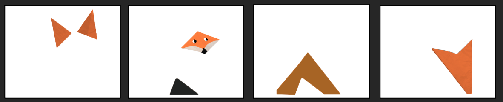
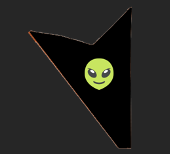
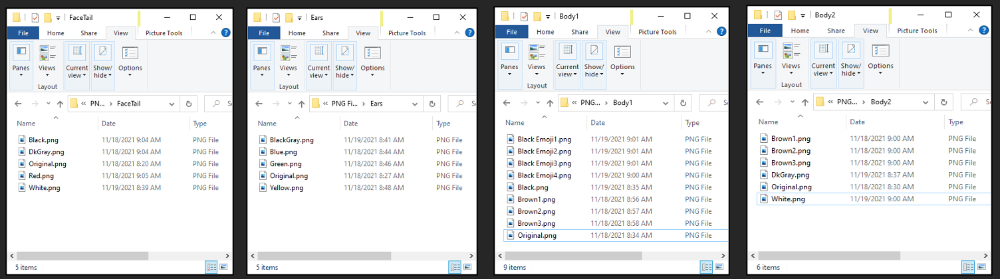
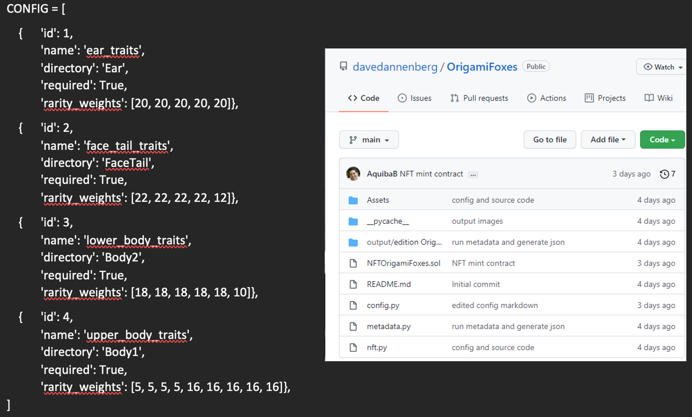
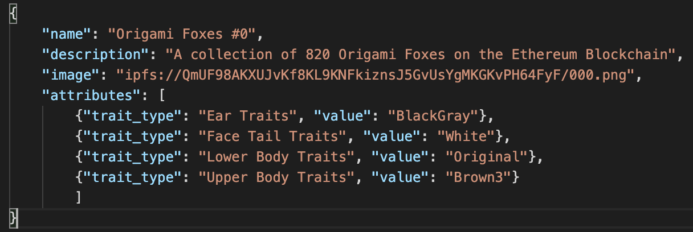
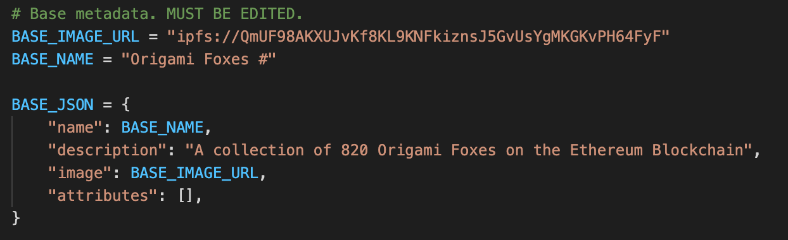

# OrigamiFoxes
## Purpose of the project
Origami foxes consists of a maximum of 750 non-fungible tokens (NFTs) based on an Origami Fox design. Origami foxes is produced using a generative NFT program and adheres to ERC-721 standards. We have also developed a decentralized app to facilitate the purchase of these NFTs, which runs on streamlit and IPFS. 

NFTs have seen increasing popularity over the past year, with early popular generative NFTs including Cryptopunks and the Bored Ape Yacht Club. In many instances, early generative NFTs sell for tens if not hundreds of thousands of dollars making them inaccessible to the vast majority of crypto users. Origami Foxes uses a similar generative concept creating uniquely patterned foxes that will be available for every individual in our class to mint and use across their digital footprint.

## Technologies used in the creation of Origami foxes (needs updating)
Origami foxes makes use of the following languages, libraries, and systems:
- Python and pip. Libraries include:
    - pandas
    - numpy
    - time
    - os
    - progressbar
    - json
    - deepcopy (from copy)
    - image (from PIL)
    - random
    - Web3, HTTPProvider, contract (from web3)
    - warnings
- IPFS (Pinata)
- Solidity
- Streamlit
- OpenZeppelin with the following Libraries:
    - ERC721 to import the basic NFT functions
    - IERC721Metadata to provide NFT metadata
    - SafeMath for robust math functions
    - Ownable for basic authorization control functions
    - Counters to count called tokenIds (NFTs)

## Guide to creating Origami Fox NFTs
### The Generation Process
Origami Foxes were generated by stacking PNG images on top of one another. We use four traits to make each origami fox: ears, facetail, lowerbody and upperbody, as can be seen in the image below. 

We also include an emoji on foxes that have black upperbodies, seen in the image below.

Each trait category contains 5 – 9 distinct combinations of colors and designs, comprising a total of 25 images saved as .png files.

All input images should be in an 'assets' folder, and MUST be ordered. Each trait (or category) of images must be put in a folder of its own.

Each trait image as well as the final fox image has exactly the same dimension. The unique NFTs are created by stacking one .png file from each of the four trait categories. Each of the 25 traits has a “rarity weight” which dictates how often a given trait will appear in an NFT. 

### Configuring the config.py file
We implemented a Python list variable called CONFIG which contains a dictionary for each of our four trait categories, each with five keys: id, name, directory, required, and rarity_weights. 

Each trait needs to specify the following keys:
1. id: A number representing a particular layer
2. name: The name of the layer. Does not necessarily have to be the same as the directory name containing the layer images.
3. directory: The folder inside assets that contain traits for the particular layer
4. required: If the particular layer is required (True) or optional (False). The first layer must always be set to true.
5. rarity_weights: Denotes the rarity distribution of traits. We use an array of numbers where each number represents a weight. 

### Generating the collection of NFTs
Once the config file is configured run the nft.py file to generate the collection of nfts. It will check to make sure the config file is valid, tell you the total number of distinct possible combiations (of NFTs) and will ask you how many avatars you'd like to create. Once the program is finished running (it may take several minutes and up to an hour if you are generating 20K+ NFTs) the images and their related metadata will be available in the output folder. 

### Bringing the generated NFTs to the blockchain
To save space and reduce costs blockchain-associated storate costs we generate metadata in a JSON format for each NFT. See the image below.

However, storing this data is still expensive. To reduce costs further, we upload this JSON to the cloud, capture the URL pointing to the JSON file for each NFT, and store the URL on the blockchain. 

### Upload images to IPFS
We use IPFS as it's decentralized and immutable. Every file stored on the network has a unique address. If the contents of the file change, so does its network address. This makes it appropriate for storing NFTs. 

We use a service acalled Pinata to upload our images to IPFS. Upload the folder of the images, which will reture a unique CID. 

### Generate compliant JSON NFT metadata
The JSON NFT file must be compliant and understandable by NFT marketplaces. Use the metadata.py file. Inside of it, update the BASE_IMAGE_URL, BASE_NAME and BASE_JSON. Set the BASE_IMAGE_URL to the IPFS URL (CID) that leads to the folder containing your images. 

You can change the BASE_NAME and 'description' in BASE_JSON to fit your projects needs.

Next, open the Terminal and run the metadata.py file and enter the edition you are generating the metadata for. This will genergate the JSON metadata for all your JSON files in a folder called JSON under output/edition.

### Upload metadata files to IPFS
Upload your JOSN metadata folder to IPFS using Pinata, similar to how you uploaded the images.

### Create smartcontract
We created an ERC721 compliant contract and imported the following libraries from OpenZeppelin:

- ERC721 to import the basic NFT functions
- IERC721Metadata to provide NFT metadata
- SafeMath for robust math functions
- Ownable for basic authorization control functions
- Counters to count called tokenIds (NFTs)

We capped the supply of NFTs to 760 and allowed for 1 NFT per mint.

We created the following functions in the smart contract:

- *reserveNFT* function to mint NFTs for free
- *setBaseURI* function to specify JSON file in IPFS
- *mintNFTs* function to perform pre-mint checks
- *mintSingleNFT* function to mint NFT to msg.sender

### Deploy smartcontract

We deployed the smart contract on Ethereum's Testnet Rinkeby and can be found in the following address: 
https://rinkeby.etherscan.io/address/0x42c877DA4FBb752B1c9cBcB00e4163d57AC40965

## Contributors
Aquiba Benarroch, Dariush Ruch-Kamgar, David Dannenberg and Tim Moriarty. This project is largely based on the Scrappy Squirrels tutorial, which can be found on Medium. 
